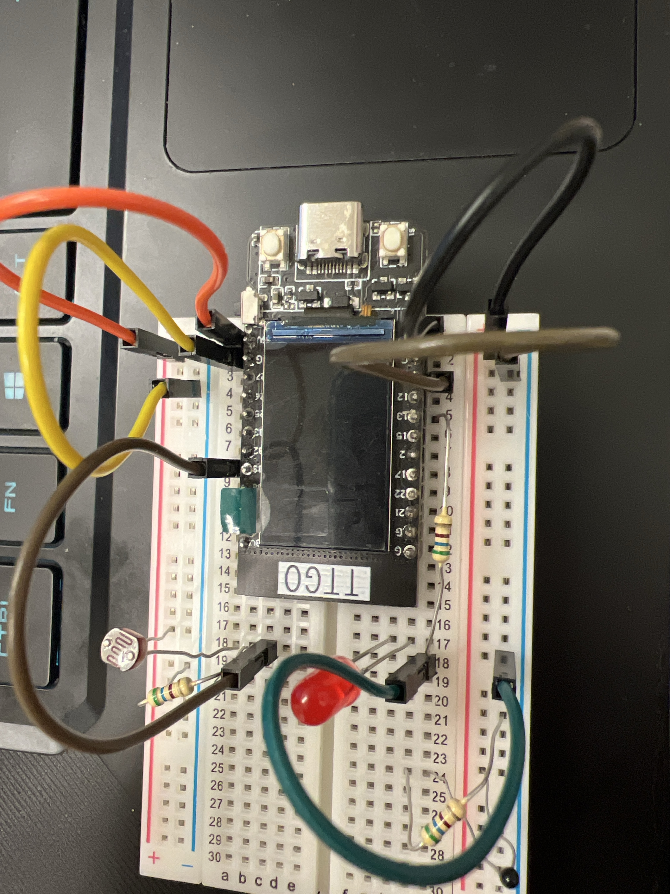
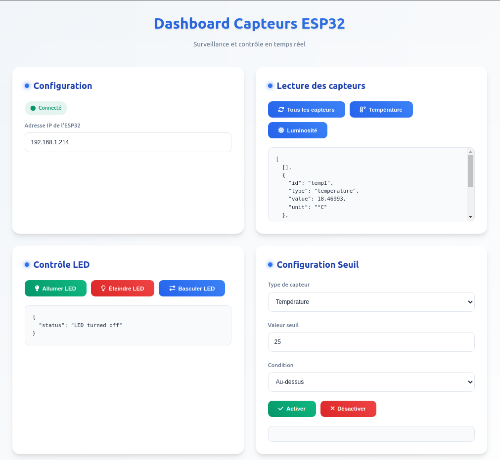

# ESP32 Sensor Monitoring System 🌡️💡

Un système de monitoring de capteurs basé sur ESP32 avec une interface web interactive permettant de surveiller la température et la luminosité en temps réel.


*Interface du dashboard web*

## 📋 Table des matières

- [Fonctionnalités](#fonctionnalités)
- [Configuration matérielle](#configuration-matérielle)
- [Installation](#installation)
- [Configuration logicielle](#configuration-logicielle)
- [API Reference](#api-reference)
- [Interface utilisateur](#interface-utilisateur)
- [Dépannage](#dépannage)

## ✨ Fonctionnalités

- Lecture en temps réel des capteurs :
  - Température (thermistance)
  - Luminosité (photorésistance)
- Contrôle LED avec plusieurs modes :
  - On/Off manuel
  - Basculement
  - Contrôle automatique basé sur des seuils
- Interface web responsive avec dashboard en temps réel
- API RESTful complète
- Configuration de seuils avec conditions personnalisables
- Support CORS pour l'intégration avec d'autres applications
- Affichage sur écran TTGO T-Display

## 🛠️ Configuration matérielle

### Composants nécessaires

- ESP32 TTGO T-Display
- Thermistance NTC 10kΩ
- Photorésistance (LDR)
- Résistances 10kΩ (×2)
- LED
- Résistance 220Ω pour la LED
- Fils de connexion

### Schéma de connexion


*Schéma de câblage des composants*

### Brochage

| Composant    | Pin ESP32 |
|--------------|-----------|
| Thermistance | GPIO 36  |
| LDR         | GPIO 39  |
| LED         | GPIO 13  |
| Bouton 1    | GPIO 0   |
| Bouton 2    | GPIO 35  |

## 📥 Installation

1. Cloner le repository :
```bash
git clone https://github.com/votre-username/esp32-sensor-monitoring.git
cd esp32-sensor-monitoring
```

2. Ouvrir le projet dans l'IDE Arduino

3. Installer les bibliothèques requises :
   - ESPAsyncWebServer
   - ArduinoJson
   - TFT_eSPI
   - WiFi

4. Configurer les informations WiFi dans `config.cpp` :
```cpp
const char* WIFI_SSID = "votre_ssid";
const char* WIFI_PASSWORD = "votre_mot_de_passe";
```

5. Téléverser le code vers l'ESP32

## ⚙️ Configuration logicielle

### Structure du projet

```
esp32-sensor-monitoring/
├── src/
│   ├── config.h
│   ├── config.cpp
│   ├── sensors.h
│   ├── sensors.cpp
│   ├── display.h
│   └── display.cpp
├── index.html
├── images/
|   ├── Interface.png
|   ├── iot.jpeg
└── README.md
```

### Paramètres configurables

- `config.h` : Configuration des pins et paramètres des capteurs
- Seuils de déclenchement personnalisables via l'interface web
- Intervalle de rafraîchissement modifiable dans le code (actuellement 1s)

## 📡 API Reference

### Endpoints disponibles

| Endpoint | Méthode | Description |
|----------|---------|-------------|
| `/api/sensors` | GET | Liste tous les capteurs |
| `/api/sensors/{id}` | GET | Obtient les données d'un capteur spécifique |
| `/api/led` | POST | Contrôle la LED |
| `/api/threshold` | POST | Configure les seuils |

### Exemples de requêtes

#### Lecture des capteurs
```bash
curl http://[ESP32_IP]/api/sensors
```

#### Contrôle LED
```bash
curl -X POST http://[ESP32_IP]/api/led \
  -H "Content-Type: application/json" \
  -d '{"state":"on"}'
```

## 💻 Interface utilisateur


*Sections principales de l'interface*

L'interface web propose quatre sections principales :
1. **Configuration** : Paramètres de connexion
2. **Lecture des capteurs** : Affichage en temps réel
3. **Contrôle LED** : Boutons de contrôle manuel
4. **Configuration Seuil** : Paramètres de déclenchement automatique

### Fonctionnalités de l'interface

- Mise à jour automatique toutes les 2 secondes
- Indicateur de connexion en temps réel
- Affichage formaté des données JSON
- Design responsive pour mobile et desktop

## 🔧 Dépannage

### Problèmes courants

1. **Connexion WiFi impossible**
   - Vérifier les identifiants dans config.cpp
   - S'assurer que l'ESP32 est dans la portée du réseau

2. **Lectures de capteurs incorrectes**
   - Vérifier les connexions physiques
   - Calibrer les valeurs R1 dans config.h

3. **Interface web inaccessible**
   - Vérifier l'adresse IP de l'ESP32 dans la console série
   - S'assurer que le client est sur le même réseau

### LED Status

| État LED | Signification |
|----------|---------------|
| Off | Système normal |
| On | Seuil dépassé |
| Clignotant | Erreur système |

## 📝 

